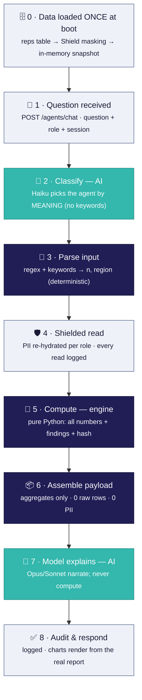
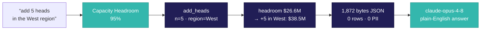

# Voiant — Technical Flow: from question to answer

This document traces **exactly** what happens on every request, step by step: how the
question is classified, how data is retrieved, how it is parsed, what is computed, how the
payload is assembled, and how it is sent to the model. File/function references are given so
each step is verifiable in the code.

> **Core principle.** A **deterministic Python engine computes every number and finding.**
> The AI (Claude) does only two things: (1) understand the question, and (2) explain the
> already-computed numbers in plain English. The model never computes, filters, or invents a
> figure. This is what makes the system auditable and guarantees *same question → same answer*.

---

## The flow at a glance

The colour tells the story: **teal = AI (Claude)**, **navy = deterministic engine**,
**grey = secure I/O**. Only two steps are AI — *understand* the question and *explain* the
answer. Everything that touches a number is deterministic.

Throughout the steps below, we follow one concrete example:

> **Question:** *"What if we add 5 heads in the West region?"* · **Role:** admin

> 📊 **Prefer a visual walk-through for a client?** The same flow as a branded, shareable page:
> [Voiant — How a question becomes an answer](https://claude.ai/code/artifact/fbcacbca-d197-44a8-b240-6c3b962e0410)

---

## Step 0 — Data is loaded ONCE at boot (not per question)

Before any question is asked, the dataset is loaded and masked a single time at startup.

- `app/runtime.py` → `bootstrap()` dispatches on `VOIANT_DATA_SOURCE`:
  - `database` → `_load_database()` runs `SELECT … FROM reps` (SQLAlchemy) against `VOIANT_DATABASE_URL`.
  - `csv` / `synthetic` are the other sources.
- Each record's **PII fields** (`display_name`, `email`) are sent to the Bright Masker
  (`app/shield/masking.py` → `POST /mask`) and replaced with **stable tokens** like
  `[PERSON 6]`, `[EMAIL 3]`. The token↔value mapping is stored in the **`shield_map`** vault.
- The result is an **in-memory masked snapshot** (`DatasetSnapshot.masked_reps`) — the working
  set for the whole session.

**Consequence:** every question runs against this in-memory snapshot. **We do not run a new
database query per question.** (Surfaced in the trace as *"loaded from the reps table … masked
ONCE at boot"*.)

---

## Step 1 — Question received

- **Endpoint:** `POST /agents/chat` — `app/api/routers/agents.py`
- **Body:** `{ question, role, session_id, allow_llm }` (`app/schemas/api.py::ChatRequest`)
- Handed to `app/services/analysis_service.py::run_agent(rt, question, role, session_id, allow_llm)`.
- **Session:** `rt.ensure_session()` creates/looks up an in-memory session; `rt.last_agent()` and
  `rt.session_memory()` provide conversation context for follow-ups. *(Memory is in-RAM only,
  never persisted.)*

Example input: `{ question: "What if we add 5 heads in the West region?", role: "admin" }`

---

## Step 2 — Semantic classification (AI #1)

- **Where:** `app/agents/orchestrator.py::plan(question, llm, last_agent, history)`
- A **small, fast model — Claude Haiku** (`claude-haiku-4-5`, configurable via
  `voiant_model_classifier`) — reads the *meaning* of the question and returns strict JSON:
  `{ "agent": …, "confidence": 0-1, "reason": "…" }` (`app/llm/client.py::classify`,
  prompt in `app/llm/prompts.py::classifier_prompt`).
- **No keyword matching.** Paraphrases, typos, and vague follow-ups all route correctly; the
  last 3 turns are passed in so *"what about the west?"* stays on the previous agent.
- **Fallback (model offline):** stay on the last agent, else default to `quota_equity`. There is
  no keyword guessing.
- Agents available: `quota_equity`, `capacity_headroom` (and `synthesis` when both are needed).

Example result: `agent = capacity_headroom`, `confidence = 0.95`,
`reason = "Adding headcount is fundamentally a capacity and load question."`

---

## Step 3 — Input parsing (deterministic — NOT the model)

For the capacity agent, any **what-if scenario** parameters are extracted from the raw text.

- **Where:** `app/agents/capacity_headroom_agent.py::_detect_scenario(question, reps, config)`
- **How:**
  - Number `n` via the digit pattern `\b(\d+)\b`.
  - `region` matched against the known `Region` enum values.
  - Intent via trigger words: `add/hire/headcount` → **add_heads**, `cut/reduce/remove` →
    **cut_heads**, `how much more/carry/absorb/headroom` → **headroom_query**, else **base_analysis**.
- Returns `(scenario_outcome, parse_detail)`; `parse_detail` is surfaced in the trace's
  **"Input parsing"** section so the extraction is fully visible.

Example: intent = `add_heads`, params = `{ n: 5, region: "West" }`.
*(The quota agent has no parameters to parse — it always runs a full fairness analysis.)*

---

## Step 4 — Shielded read (RBAC + lineage)

- **Where:** `app/agents/_reps.py::build_reps(ctx, agent_name)`
- Each rep is rebuilt from the masked snapshot. The PII fields are **re-hydrated per role** via
  `app/shield/masking.py::demask_value` reading the `shield_map` vault:
  - **admin** → full values (`[PERSON 6]` → `Liam Rossi`)
  - **analyst** → initials (`L. R.`)
  - **viewer** → stays fully redacted (token kept)
- **Every field read is logged** to the **`lineage`** table (who/which agent read which field,
  when, masked or not). The masking policy per role lives in `config/client_rapid7.yaml → rbac_roles`.

Example (admin): 80 reps rehydrated to full names; 160 field reads (name + email × 80) logged.

---

## Step 5 — Deterministic engine (the math — no AI)

- **Where:** `app/domain/engine/capacity.py::compute(reps, config, data_source)` (and
  `quota_equity.py::compute` for the fairness agent). These modules are **pure**: no IO, no LLM,
  no clock.
- The engine reads only the analytical fields — `quota, pipeline_value, segment, region,
  attainment` — over **all reps**, and computes:
  - **Capacity:** each rep's `load_index = quota ÷ segment-mean-quota`; classifies Over/Balanced/
    Under against `capacity.over_threshold` / `under_threshold` (from config); sums **team
    additional capacity** (headroom to `max_stretch`); rolls up per segment; derives redistribution
    moves.
  - **Quota equity:** deployed vs `company.top_down_target`; per-rep fairness ratio vs segment
    median → band; per-segment coefficient-of-variation → **paintbrush** flag.
- **What-if overlay:** `_detect_scenario` (step 3) calls `simulate_add / simulate_cut /
  headroom_query`, attaching a `ScenarioOutcome` with `before` / `after`.
- **Determinism hash:** SHA-256 over the canonical, Decimal-quantized output + config version +
  snapshot id (`app/domain/engine/stats.py::determinism_hash`). Same inputs → identical hash.
- **Assumptions** are always attached, and are **derived, not hardcoded** — the data-provenance
  assumption reflects the live `VOIANT_DATA_SOURCE` and `config.company.name`
  (`app/domain/engine/provenance.py`).

Example output: team additional capacity **$26.57M**, overloaded **8**, balanced **60**,
underloaded **12**; scenario `add_heads` → before 80 reps/$26.6M, **after 85 reps/$38.5M**,
feasible `true`.

**Audit:** before any narration, `ctx.recorder.record_inference(...)` writes the run (hash,
config version, finding count) to **`audit_inference`**.

---

## Step 6 — Payload assembly (what actually goes to the model)

- **Where:** `capacity_headroom_agent.py::_payload(report)` (+ `user_question` appended).
- The engine's full report is **projected down** to a compact JSON summary: team totals,
  per-segment rollups, findings, the scenario, assumptions, and the user's question.
- **Zero raw rep rows and zero PII** are included — only computed aggregates.
- Serialized with `json.dumps` → this exact string is what the model receives (shown verbatim in
  the trace under *"Input SENT to the model"*).

Example: a **~1,872-byte** JSON object. Raw rep rows sent: **0**. PII sent: **false**.

---

## Step 7 — Model explains (AI #2)

- **Where:** `capacity_headroom_agent.py::_narrate` → `app/llm/client.py::narrate`.
- **Model routing:** `claude-opus-4-8` for complex reasoning / what-if scenarios, `claude-sonnet-4-6`
  for standard narratives (`config → model_routing`).
- The **system prompt explicitly forbids computing or inventing numbers** — the model may only
  cite values present in the JSON payload (`app/llm/prompts.py`).
- If the model is unavailable, a **deterministic template narrative** is produced from the same
  numbers (byte-stable), so an answer is always returned.
- The call is logged to **`audit_llm`** (model, whether it fell back).

Result: a plain-English explanation of the computed figures — no new numbers introduced.

---

## Step 8 — Response & render

- **Where:** `analysis_service.run_agent` returns `AgentRunResponse` (`app/schemas/api.py`):
  `report` (all computed numbers), `narrative`, `determinism_hash`, `suggested_followups`,
  `memory`, and the full `trace`.
- The frontend renders **charts directly from `report`** (heatmap, load bars, rollups) —
  `frontend/src/components/{Heatmap,QuotaEquityView,CapacityView}.tsx`. **No chart uses hardcoded
  data**; every value binds to a `report` field.
- The **technical trace** (`InspectPanel.tsx`) replays all of the above: routing + confidence,
  input parsing, shield sample, engine numbers, findings, segments, assumptions, data-selection,
  and the exact model input/output.

---

## Governance & determinism (why a client can trust it)

| Guarantee | How it's enforced |
|---|---|
| Same question → same numbers | Determinism hash over Decimal-quantized engine output |
| Model can't invent figures | Engine computes everything; prompt forbids computation; numbers validated against payload |
| No PII leaves for the model | Only aggregates sent; 0 raw rows; PII replaced by Shield tokens at ingest |
| Full auditability | `lineage` (field reads), `audit_inference` (runs), `audit_llm` (model calls) |
| Reproducible config | Client rules in `client_rapid7.yaml`; runs pin a config version |
| No hardcoding | Targets/thresholds/bands live in config; provenance derived from the live data source |

## Data model (Postgres tables)

| Table | Holds |
|---|---|
| `reps` | The sales reps (source dataset) |
| `shield_map` | Token ↔ real-value vault (e.g. `[PERSON 6]` ↔ `Liam Rossi`) |
| `shield_counter` | Keeps token numbering stable/consistent |
| `lineage` | Every field read: who/which agent/when/masked |
| `audit_inference` | One row per agent run (question, hash, config version) |
| `audit_llm` | One row per model call (prompt/response metadata) |

---

## End-to-end example (all steps together)

**"What if we add 5 heads in the West region?"** (admin)

1. **Received** → `/agents/chat`.
2. **Classified** → Haiku → `capacity_headroom`, 95% ("headcount = capacity question").
3. **Parsed** → `add_heads`, `{ n: 5, region: West }` (regex + keyword, deterministic).
4. **Shielded read** → 80 reps re-hydrated for admin; 160 reads logged to `lineage`.
5. **Computed** → team headroom $26.57M; 8 over / 60 balanced / 12 under; scenario
   before 80 reps/$26.6M → after 85 reps/$38.5M; determinism hash emitted; run → `audit_inference`.
6. **Payload** → ~1,872-byte JSON (aggregates + findings + scenario + question); 0 rows, 0 PII.
7. **Model** → `claude-opus-4-8` explains the numbers; call → `audit_llm`.
8. **Response** → report + narrative + trace returned; capacity bars + rollups render from `report`.

Every number the client sees was computed in step 5; the model only wrote the sentences in step 7.
